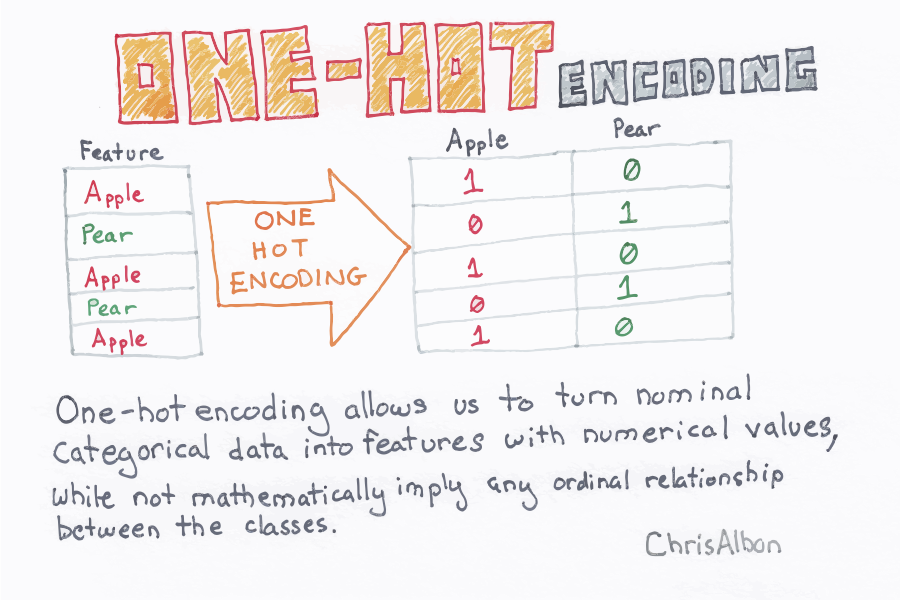

```{r setup, include=FALSE}
# Load all your packages here:
library(tidyverse)
library(GGally)
library(rpart)
library(yardstick)
# Set default behavior for all code chunks here:
knitr::opts_chunk$set(
  echo = TRUE, warning = FALSE, message = FALSE,
  fig.width = 16/2, fig.height = 9/2
)

# Set seed value of random number generator here. This is in order to get
# "replicable" randomness, so that any results based on random sampling or
# resampling are replicable everytime you knit this file. Why use a seed value
# of 76? For no other reason than 76 is one of my favorite numbers:
# https://www.youtube.com/watch?v=xjJ7FheCkCU
set.seed(76)
```

You will be fitting CART models to the data from the [Ghouls, Goblins, and Ghosts... Boo!](https://www.kaggle.com/c/ghouls-goblins-and-ghosts-boo/){target="_blank"} Kaggle competition. The competition's score for leaderboard purposes is the "Categorization Accuracy". However you will **NOT** be making any submissions to Kaggle.


***


# Load data

Read in data provided by Kaggle for this competition. They are organized in the `data/` folder of this RStudio project:

```{r}
training <- read_csv("data/train.csv")
test <- read_csv("data/test.csv")
sample_submission <- read_csv("data/sample_submission.csv")

training<- training%>%
  mutate(type=as.factor(type))
```

***


# Minimally viable product

Perform the following exploratory data analyses:

## Univariate explorations

**Categorical predictor**: Create a visualization of the categorical predictor variable `color`.

```{r}
ggplot(data = training, aes(x=color))+
  geom_bar()+
  ggtitle("visualization of the categorical predictor variable `color`")
```


**Outcome variable**: Create a visualization of the categorical predictor variable `type`.

```{r}
ggplot(data = training, aes(x=type))+
  geom_bar()+
  ggtitle("Visualization of the categorical predictor variable `type`")
```


## Mutlivariate explorations

**Numerical predictors**: Create a visualization of the relationship of all four numerical predictor variables at once (`bone_length`, `rotting_flesh`, `hair_length`, `has_soul`) using the `ggpairs()` function from the `GGally` [package](http://ggobi.github.io/ggally/#ggallyggpairs). 

```{r}
ggpairs(training, columns = c("bone_length", "rotting_flesh", "hair_length", "has_soul"))+
  ggtitle("Visualization of the relationship of all four numerical predictor variables at once")
```

**Relationship of categorical predictor and outcome variable**: Create a visualization of the relationship between the categorical outcome variable `type` and any predictor varible of your choosing.

```{r}
ggplot(data=training, aes(x=type,y=rotting_flesh,fill=type))+
  geom_bar(stat="identity")+
  ggtitle("Visualization of the relationship between the categorical outcome variable `type` and `rotting flesh`")
```


***


# Due diligence

1. Fit a CART where:
    * You use only the numerical predictors.
    * The maximum depth of the tree is 5.
    * You use the default "complexity parameter" 
1. Plot the tree.
1. Make predictions `type_hat` on the `training` data. Hint compare the output of `predict(model_CART, type = "prob")` and `predict(model_CART, type = "class")`.
1. Compute the "classification accuracy".

```{r, fig.height = 9, fig.width=16}
model_formula <- as.formula(type ~ bone_length+rotting_flesh+hair_length+has_soul)
tree_parameters <- rpart.control(maxdepth = 5)
model_CART <- rpart(model_formula, data = training, control = tree_parameters)

plot(model_CART)
text(model_CART, use.n = TRUE)
box()


p_hat_matrix_test <- model_CART %>%
  predict(type = "prob", newdata = training) %>%
  as_tibble()

model_1_fitted_points<-model_CART %>%
  predict(type="class", newdata = training) %>%
  enframe()

accuracy(data=training, truth=factor(type),estimate= factor(model_1_fitted_points$value))
```


***


# Reaching for the stars

Note that the $\alpha$ complexity parameter is the `cp` argument to `rpart.control()`.

1. Reusing the MP1 solutions code, for the range of `alpha` complexity parameters in the `alpha_df` data frame, return an estimate of the accuracy/error that Kaggle would return.
1. Plot the relationship between the alpha complexity parameter and accuracy.
1. Using the optimal $\alpha^*$ complexity parameter, write a `submission.csv` suitable for submission to Kaggle.

```{r message=FALSE, warning=FALSE}
alpha_df <- tibble(
  alpha = seq(from = 0, to = 0.05, length = 100),
  accuracy = 0
)

set.seed(76)

training <- training %>% 
  sample_frac(1) %>% 
  mutate(fold = rep(1:5, length = n())) %>% 
  arrange(fold)


for(i in 1:nrow(alpha_df)){
  alpha <- alpha_df$alpha[i]
  
  scores <- rep(0, 5)
  for(j in 1:5){
    pretend_training <- training %>% 
      filter(fold != j)
    pretend_test <- training %>% 
      filter(fold == j)
    
    # Fit model on pretend training
    model_formula <- as.formula(type ~ bone_length+rotting_flesh+hair_length+has_soul)
    tree_parameters <- rpart.control(cp = alpha)
    model_CART <- rpart(model_formula, data = pretend_training, control = tree_parameters)

    # Make predictions
    predicted_points<-model_CART %>%
      predict(type="class", newdata = pretend_test) %>%
      enframe()
    
    # compute score   
    estimate <- yardstick::accuracy(data=pretend_test, truth=factor(type), estimate= factor(predicted_points$value))
    scores[j]<- estimate$.estimate
  }
  
  alpha_df$accuracy[i] <- mean(scores) 
}

best_option<- alpha_df%>% 
  arrange(desc(accuracy)) %>% 
  filter(accuracy==max(accuracy)) %>% 
  arrange(desc(alpha))%>%
  filter(row_number()==1)
best_option

ggplot(data=alpha_df,aes(x=alpha,y=accuracy))+
  geom_hline(yintercept = max(best_option$accuracy),color = "red")+
  geom_line()+
  geom_smooth(se=FALSE)+
  geom_point(x=best_option$alpha,y=best_option$accuracy,color = "red")
```
Although we have set seed at 76, our output still varis each time we run. Here are three examples:

Max accuracy: 0.7035315; Optimal alpha: 0.011616162

Max accuracy: 0.697982; Optimal alpha: 0.010101010

Max accuracy: 0.7063423; Optimal alpha: 0.015151515

```{r fig.height=9.5, fig.width=10.5}
# Because we have different accuracy and alpha values each time, we will use the alpha in our three examples that has the highest accuracy -- alpha = 0.015151515

model_formula_test <- as.formula(type ~ bone_length+rotting_flesh+hair_length+has_soul)
tree_parameters_test <- rpart.control(cp = 0.015151515)
model_CART_test <- rpart(model_formula_test, data = training, control = tree_parameters)

plot(model_CART_test) 
text(model_CART_test, use.n = TRUE)
box()

p_hat_matrix <- model_CART_test %>%
  predict(type = "prob", newdata = test) %>%
  as_tibble()

model_fitted_points<-model_CART_test %>%
  predict(type="class", newdata = test) %>%
  enframe()

submission<- sample_submission%>%
  mutate(type=model_fitted_points$value)
write_csv(submission, path = "data/submission.csv")
```
***

# Point of diminishing returns

* Use one-hot-enconding to fit a predictive CART model using the categorical variable `color` and plot the tree. Set the maximum depth of the tree to 5 and use the default "complexity parameter".
* No need to generate an estimate of the accuracy that Kaggle would return. 


```{r}
training<-training%>%
  mutate(clear = ifelse(color=="clear",1,0))%>%
  mutate(white = ifelse(color=="white",1,0))%>%
  mutate(black = ifelse(color=="black",1,0))%>%
  mutate(green = ifelse(color=="green",1,0))%>%
  mutate(blue = ifelse(color=="blue",1,0))%>%
  mutate(blood = ifelse(color=="blood",1,0))

test<-test%>%
  mutate(clear = ifelse(color=="clear",1,0))%>%
  mutate(white = ifelse(color=="white",1,0))%>%
  mutate(black = ifelse(color=="black",1,0))%>%
  mutate(green = ifelse(color=="green",1,0))%>%
  mutate(blue = ifelse(color=="blue",1,0))%>%
  mutate(blood = ifelse(color=="blood",1,0))

#EDA
ggplot(data = training, aes(x=type))+
  geom_bar(aes(fill = color))+
  ggtitle("Type count by color")
```
```{r fig.height=9.5, fig.width=10.5}
model_formula_PDR <- as.formula(type ~ clear+white+black+green+blue+blood)
tree_parameters_PDR <-rpart.control(maxdepth =5)
model_CART_PDR <- rpart(model_formula_PDR, data = training, control = tree_parameters_PDR)

plot(model_CART_PDR)
text(model_CART_PDR, use.n = TRUE)
box()

p_hat_matrix_PDR <- model_CART_PDR %>%
  predict(type = "prob", newdata = test) %>%
  as_tibble()

model_fitted_points_PDR<-model_CART_PDR %>%
  predict(type="class", newdata = test) %>%
  enframe()
```

We found that if we use a smaller cp (cp=0.00001), there will be more branches.
